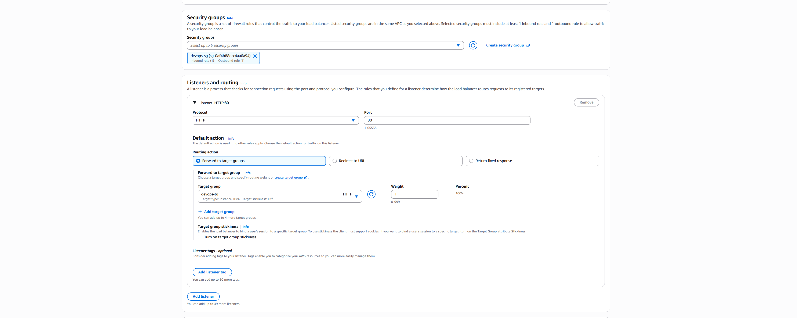
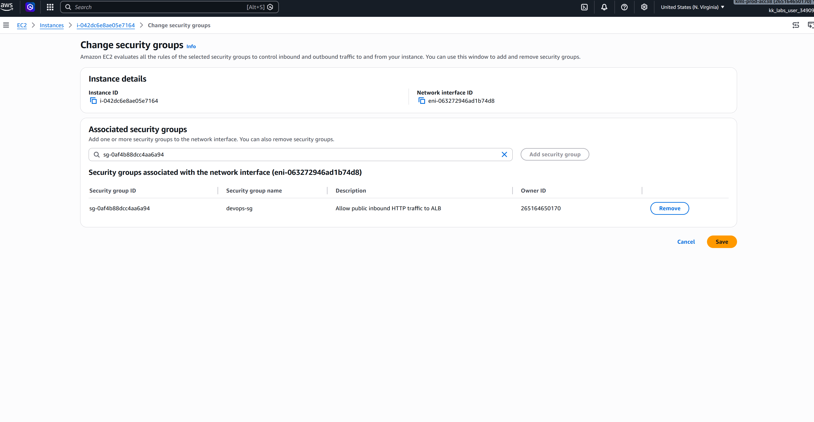
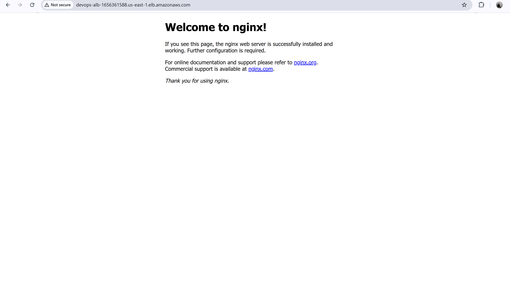

### 1. Security Infrastructure Topology

Configured a dedicated public-facing Security Group (devops-sg) explicitly opening inbound HTTP traffic vectors on Port 80 to allow traffic from the open internet:

### 2. High-Availability Load Balancing Setup

Initiated a Layer 7 Application Load Balancer (devops-alb) to balance workloads across the infrastructure:

Configured multi-Availability Zone network mappings to ensure high availability and resilient public routing:

Linked inbound traffic channels directly to target groups via specialized listener routing mechanics:

### 3. Backend Target Group Registration

Created the logical target group layer (devops-tg) tracking the health status and routing traffic directly to the backend computing assets:

Verified security policy attachments directly on the backend compute interfaces to secure communication paths:

### 4. End-to-End Traffic Verification

The live application rendering flawlessly when accessed directly via the globally resolved AWS Application Load Balancer DNS endpoint, confirming complete network and firewall routing alignment:

